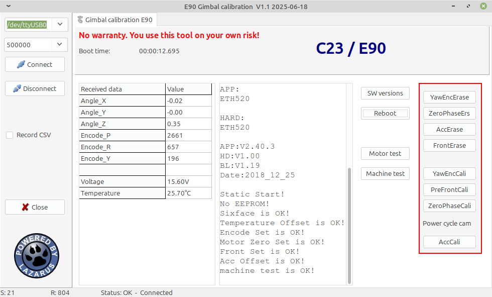

# E90_calibration
## E90/C23 camera family - gimbal calibration SW.
This tool provides UART (serial) connection to the C23/E90 and possibly other modern Yuneec cameras. Tested also with CGO-ET from H520.
Additional functions are Motor test and Machine test of the camera. Do not touch anything during Machine test.

This tool provides a possibility to fully calibrate the gimbal of the C23/E90. This functionality is experimental. Use it on your own risk.

Download this tool at download page: <http://h-elsner.mooo.com/html/downl.htm>
Binaries for Windows (.zip) and LINUX (.tar.gz) are available. 

*Installation:* No installation, simply unzip the file. It is a portable application. You need only the executable for your OS. Copy it somewhere in the home file system or to an USB stick.

To compile this tool you need the common units from this repo: https://github.com/h-elsner/common_units Also the packages Synapse and Industrial stuff have to be installed (use OPM).
